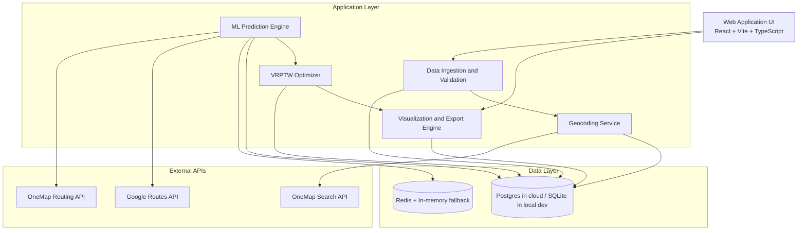
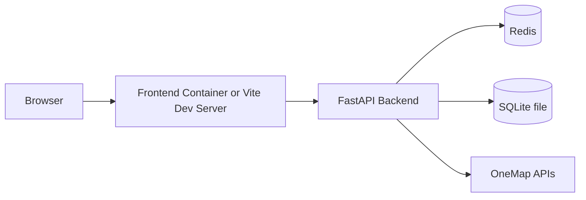
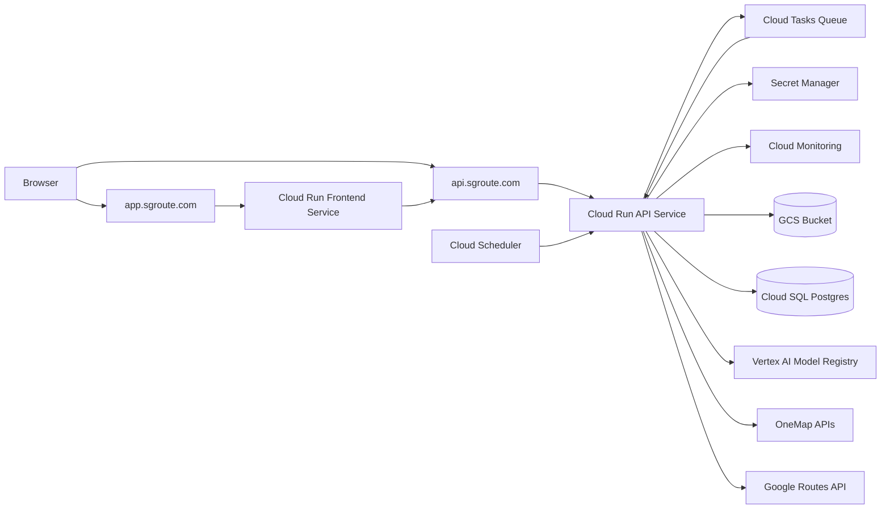

# SG Route Optimization Architecture

This document translates the planned FYP architecture into the current codebase and records production-oriented implementation status (updated February 22, 2026).

## 1) Layered Architecture



## 2) Runtime Pipeline

```mermaid
sequenceDiagram
    participant Planner as Planner (UI)
    participant API as FastAPI Backend
    participant Tasks as Cloud Tasks
    participant OneMap as OneMap APIs
    participant Google as Google Routes API
    participant Vertex as Vertex AI Batch Prediction
    participant Cache as Redis/Memory Cache
    participant DB as Database

    Planner->>API: Upload CSV/XLSX
    API->>API: Validate structure + rows
    API->>DB: Save dataset/stops/error_logs
    API-->>Planner: Validation summary + next action

    Planner->>API: Start geocoding
    API->>OneMap: Search address/postal
    API->>DB: Save lat/lon + status
    API-->>Planner: Geocoding result + failed stops

    Planner->>API: Start async optimize job
    API->>DB: Create QUEUED optimize job + step state
    API->>Tasks: Enqueue GEOCODE step
    Tasks->>API: POST /tasks/handle (OIDC)
    API->>OneMap: Geocode unresolved stops
    API->>DB: Save geocode updates + enqueue BUILD_MATRIX
    Tasks->>API: POST /tasks/handle
    API->>Cache: Check OD route cache
    API->>OneMap: Fetch missing route time/distance
    API->>Google: Optional live-traffic ETA path
    API->>API: Build matrix + local ML baseline
    API->>Vertex: Optional batch override (FEATURE_VERTEX_BATCH_OVERRIDE=true)
    Vertex-->>API: Predicted durations or timeout/failure
    API->>API: Apply Vertex override when available; otherwise keep local baseline
    API->>API: Solve VRPTW (OR-Tools)
    API->>DB: Persist plan/routes/route_stops + export refs
    API-->>Planner: Poll/stream job status -> SUCCEEDED/FAILED

    Planner->>API: Fetch results + export CSV/PDF
    API-->>Planner: Map-ready route data + files
```

## 3) Current Module Mapping

- UI layer
- `frontend/src/pages/UploadPage.tsx`
- `frontend/src/pages/GeocodingPage.tsx`
- `frontend/src/pages/OptimizationPage.tsx`
- `frontend/src/pages/ResultsPage.tsx`

- API and orchestration
- `backend/app/main.py`
- `backend/app/api/datasets.py`
- `backend/app/api/stops.py`
- `backend/app/api/plans.py`
- `backend/app/api/jobs.py`

- Core services
- `backend/app/services/validation.py`
- `backend/app/services/datasets.py`
- `backend/app/services/geocoding.py`
- `backend/app/services/onemap_client.py`
- `backend/app/services/routing.py`
- `backend/app/services/ml_engine.py`
- `backend/app/providers/google_routes.py`
- `backend/app/services/traffic_provider_google.py`
- `backend/app/services/vrptw.py`
- `backend/app/services/optimization.py`
- `backend/app/services/job_pipeline.py`
- `backend/app/services/job_tasks.py`
- `backend/app/services/export.py`
- `backend/app/services/cache.py`

- Data layer
- `backend/app/models/entities.py`

## 4) Gap Closure Status (As Of February 22, 2026)

### A) MLOps lifecycle

Implemented:
- Model registry and rollout/canary controls
- Config endpoints:
  - `GET /api/v1/ml/config`
  - `POST /api/v1/ml/config`
  - `POST /api/v1/ml/rollout`
- Monitoring and drift endpoints:
  - `GET /api/v1/ml/metrics/latest`
  - `POST /api/v1/ml/drift-report`
- Optional Vertex training trigger:
  - `POST /api/v1/ml/models/train/vertex`

Current production behavior:
- Baseline training supports both local artifact mode and Vertex-integrated registration mode.
- Model selection for prediction is rollout-driven (`active_version`, optional canary split).
- `GET /api/v1/ml/config` exposes both `feature_vertex_ai` and `feature_vertex_batch_override` operator flags.
- Google traffic and ML uplift feature flags are supported in production runtime.
- Runtime fallback diagnostics include structured `details=` payload for request-level failures.

### B) Async jobs and progress streaming

Implemented:
- Async optimize pipeline via Cloud Tasks-compatible callbacks:
  - `POST /api/v1/jobs/optimize`
  - `POST /tasks/handle`
- Step orchestration:
  - `GEOCODE -> BUILD_MATRIX -> OPTIMIZE -> GENERATE_EXPORTS`
- Job state with progress and step metadata:
  - `GET /api/v1/jobs/{job_id}`
  - `GET /api/v1/jobs/{job_id}/events`
- Cloud callbacks are OIDC-validated and confirmed 2xx for production payload format.

### C) Interactive route editing

Implemented:
- Planner-side resequencing preview/revert/apply flow
- Backend resequencing endpoint:
  - `POST /api/v1/plans/{plan_id}/routes/{route_id}/resequence`
- Violation badges/tooltips and timing-impact visibility in Results UI

### D) Production traffic runtime resiliency

Implemented:
- OneMap route failures in OD construction now fall back to heuristic estimates instead of hard-failing matrix build.
- Google traffic departure timestamp is clamped to a near-future value for API compatibility.
- Google request failures capture request/cause/DNS diagnostics in logs.
- Vertex batch override in `BUILD_MATRIX` is guarded by explicit feature flag and bounded timeouts/output-wait windows.
- Async optimize job payload now captures Vertex batch diagnostics (`vertex_batch_used`, `reason`, optional `job_name`/`state`) when override is unavailable.
- Pipeline step leases support stale-lock reclaim for Cloud Tasks redelivery safety.
- Slow optimize and retry/failure conditions are surfaced through Phase 7 log markers for alerting.

## 5) Suggested Next Delivery Plan

1. Milestone 1
- Run a short production burn-in window after threshold tuning and capture false-positive/false-negative alert notes.
2. Milestone 2
- Automate model promotion policy (evaluation guardrails before rollout) and document rollback procedure.
3. Milestone 3
- Add a lightweight release checklist that verifies domains, queue health, and ML config post-deploy.
4. Milestone 4
- Expand feedback ingestion coverage and formalize retention/backfill rules for training data.

## 6) Deployment View (Current Local MVP)



## 7) Deployment View (Current Cloud Run Production)


