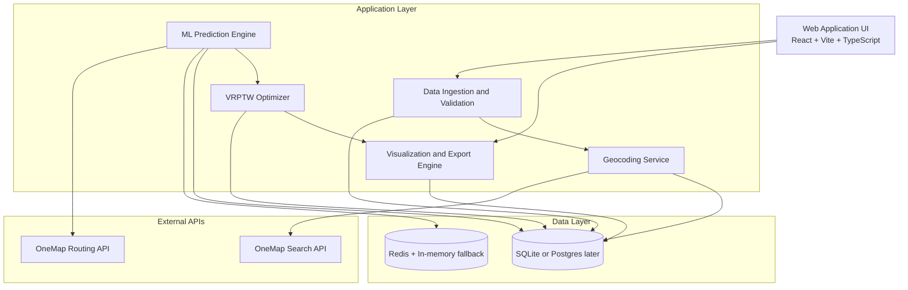
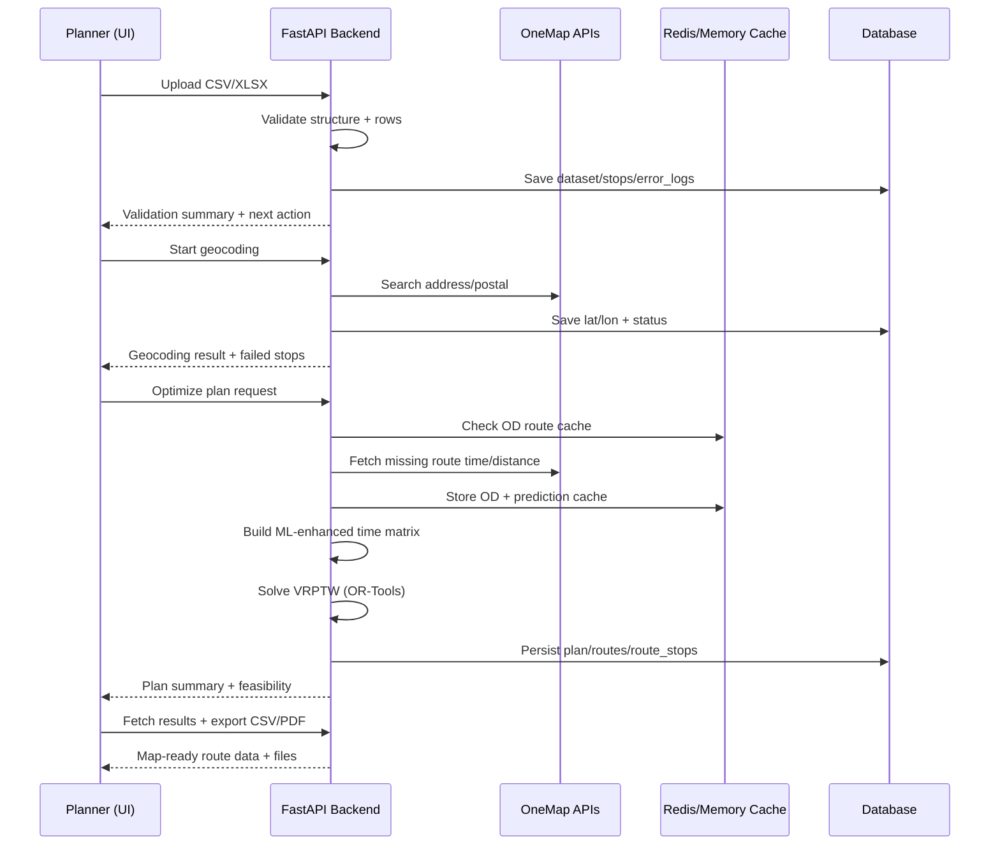
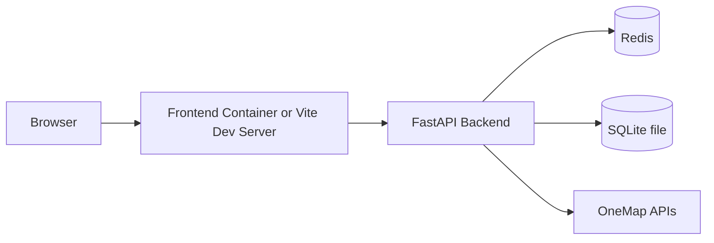

# SG Route Optimization Architecture

This document translates the planned FYP architecture into the current codebase and defines the next implementation steps for the main gaps.

## 1) Layered Architecture

## 2) Runtime Pipeline

## 3) Current Module Mapping

- UI layer
- `frontend/src/pages/UploadPage.tsx`
- `frontend/src/pages/GeocodingPage.tsx`
- `frontend/src/pages/OptimizationPage.tsx`
- `frontend/src/pages/ResultsPage.tsx`

- API and orchestration
- `backend/app/main.py`
- `backend/app/api/datasets.py`
- `backend/app/api/stops.py`
- `backend/app/api/plans.py`

- Core services
- `backend/app/services/validation.py`
- `backend/app/services/datasets.py`
- `backend/app/services/geocoding.py`
- `backend/app/services/onemap_client.py`
- `backend/app/services/routing.py`
- `backend/app/services/ml_engine.py`
- `backend/app/services/vrptw.py`
- `backend/app/services/optimization.py`
- `backend/app/services/export.py`
- `backend/app/services/cache.py`

- Data layer
- `backend/app/models/entities.py`

## 4) Main Gaps and How to Close Them

### Gap A: MLOps lifecycle is minimal

What is missing:
- Model registry and explicit promotion flow (dev/staging/prod)
- Feedback loop with actual-vs-predicted monitoring
- Drift detection and scheduled retraining

How to implement:
1. Add DB tables:
- `model_registry(id, model_version, stage, metrics_json, created_at, promoted_at)`
- `training_runs(id, model_version, data_window_start, data_window_end, metrics_json, status, created_at)`
- `prediction_feedback(id, od_cache_id, model_version, predicted_duration_s, actual_duration_s, timestamp)`
2. Save model metadata in `model_registry` during training (`backend/app/ml/train.py`).
3. Add feedback ingestion endpoint:
- `POST /api/v1/ml/feedback`
4. Add periodic job:
- Compute MAE/MAPE by hour/day and compare against threshold.
5. Add retrain command:
- `python -m app.ml.train --input ... --promote-if-better`

Acceptance criteria:
- You can see active model version in API response.
- You can track error metrics over time.
- Retrain decision is data-driven, not manual guesswork.

### Gap B: No async jobs and progress streaming

What is missing:
- Geocoding and optimization are synchronous for longer workloads.
- UI cannot show true progress percentage and partial logs.

How to implement:
1. Add job runner:
- Preferred MVP: `RQ + Redis` (lightweight)
- Alternative: Celery if you need richer workflows
2. Add tables:
- `jobs(id, type, status, progress, started_at, finished_at, payload_json, result_json, error_json)`
3. Convert long endpoints to async-start:
- `POST /api/v1/datasets/{id}/geocode/start` returns `job_id`
- `POST /api/v1/datasets/{id}/optimize/start` returns `job_id`
4. Add status endpoints:
- `GET /api/v1/jobs/{job_id}`
- Optional SSE: `GET /api/v1/jobs/{job_id}/events`
5. UI polling/SSE:
- Show progress bar, step label, last error, cancel/retry actions.

Acceptance criteria:
- Large dataset geocoding does not block request thread.
- Planner sees real-time status and can resume safely after refresh.

### Gap C: Interactive route editing is not implemented

What is missing:
- No drag-and-drop reordering of stops in route itinerary.
- No post-edit constraint revalidation and ETA recalculation endpoint.

How to implement:
1. Frontend:
- Add drag-and-drop list per vehicle (for example `@dnd-kit`).
2. Backend endpoint:
- `POST /api/v1/plans/{plan_id}/routes/{route_id}/resequence`
- Payload: ordered `route_stop_ids`.
3. Validation service:
- Recompute ETA/timing and flag violations:
- `time_window_violation`, `workday_violation`, `capacity_violation`.
4. Result contract:
- Return updated stop sequence, ETAs, and violation warnings.
5. UI behavior:
- Show warning badges and require confirm before exporting invalid plan.

Acceptance criteria:
- Planner can manually adjust stop order.
- System immediately shows impact on ETA and constraint health.

## 5) Suggested Delivery Plan

1. Milestone 1 (high impact)
- Async jobs + progress APIs + frontend progress UI.
2. Milestone 2
- Route resequencing endpoint + UI drag-drop + revalidation.
3. Milestone 3
- MLOps metadata tables + feedback capture + metrics dashboard endpoint.
4. Milestone 4
- Automated retraining and model promotion workflow.

## 6) Deployment View (Current Local MVP)

